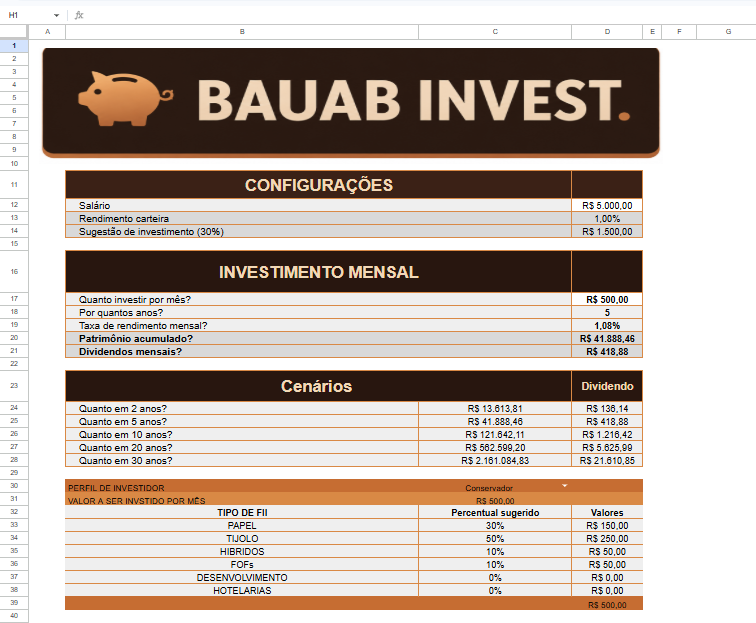

# 📈 Simulador Financeiro de Investimentos em FIIs

> Projeto desenvolvido como parte do **Curso DIO - Santander - Excel com Inteligência Artificial - 2º Semestre**.

Uma ferramenta interativa desenvolvida em Microsoft Excel (e compatível com Google Planilhas) para simulação de patrimônio, dividendos e alocação estratégica em **Fundos Imobiliários (FIIs)** com base no perfil do investidor.

---

## 💡 Sobre o Projeto

O objetivo deste laboratório é aplicar conceitos práticos e avançados de planilhas eletrônicas para solucionar dúvidas frequentes de quem deseja investir: *Quanto preciso aportar por mês? Quanto terei em dividendos no futuro? Como dividir meus investimentos de acordo com o meu perfil?*

A solução automatiza cálculos financeiros complexos, oferecendo uma interface limpa, intuitiva e funcional para tomada de decisões financeiras informadas.

---

## 🛠️ Funcionalidades e Estrutura da Planilha

A ferramenta é dividida em blocos visuais e lógicos para facilitar a navegação do usuário:

* **1. Banner Visual & Configurações Iniciais:**
  * **Salário Mensal:** Campo editável pelo usuário.
  * **Rendimento de Carteira Base:** Taxa de referência ajustável (padrão 1,00%).
  * **Sugestão de Aporte:** Cálculo automatizado sugerindo 30% de aporte sobre o salário informado.

* **2. Simulação de Investimento Mensal:**
  * **Entradas do Usuário:** Valor do aporte mensal, horizonte de tempo (anos) e taxa de rendimento mensal (padrão em 1,08%, personalizável).
  * **Resultados Automatizados:** Cálculo de **Patrimônio Acumulado** e estimativa de **Dividendos Mensais** ao final do período.

* **3. Projeção de Cenários Temporais:**
  * Linhas dinâmicas calculando automaticamente o patrimônio e os dividendos gerados para os horizontes de **2, 5, 10, 20 e 30 anos** com base no aporte definido.

* **4. Matriz de Alocação por Perfil de Investidor:**
  * Menu suspenso para seleção do perfil (**Conservador**, **Moderado** ou **Agressivo**).
  * Distribuição percentual e financeira automática dividida nas categorias de FIIs: *Papel, Tijolo, Híbridos, FoFs, Desenvolvimento e Hotelaria*.
  * Vinculação direta com tabela de apoio e busca automatizada.

---

## 📐 Conceitos Técnicos Aplicados

* **Formulas e Funções:** `PROCV` (VLOOKUP), funções matemáticas, financeiras e lógicas (`SE`/`IF`).
* **Validação de Dados:** Criação de menus suspensos (drop-down) para seleção de perfis de risco.
* **Intervalos Nomeados:** Organização e facilidade na leitura de fórmulas complexas.
* **Tabelas de Apoio (Lookups):** Matriz de referência utilizada para determinar a porcentagem de alocação por categoria de ativo.
* **Design & UX no Excel:** Padronização visual, paleta de cores temática (tons terrosos) e hierarquia visual focada na usabilidade do usuário.

---

## 🚀 Como Utilizar

1. Faça o download do arquivo `.xlsx` presente neste repositório.
2. Abra o arquivo no Microsoft Excel ou importe no Google Planilhas.
3. Preencha os campos da seção de **Configurações** e **Investimento Mensal**.
4. Altere a seleção da célula de **Perfil de Investidor** para visualizar a alocação recomendada para o seu momento financeiro.

---

## 🎓 Aprendizados (DIO & Santander)

Durante a execução deste desafio foi possível consolidar competências em:
* Estruturação de simuladores financeiros no Excel.
* Automação de cálculos de juros compostos e proventos de fundos imobiliários.
* Organização de documentação técnica e controle de versão no GitHub.

---
Demonstração da ferramenta:

---
## 👨‍💻 Autor
Caio Pereira Bauab

Desenvolvido como projeto de estudo para a **Digital Innovation One (DIO)** em parceria com o **Santander**.
